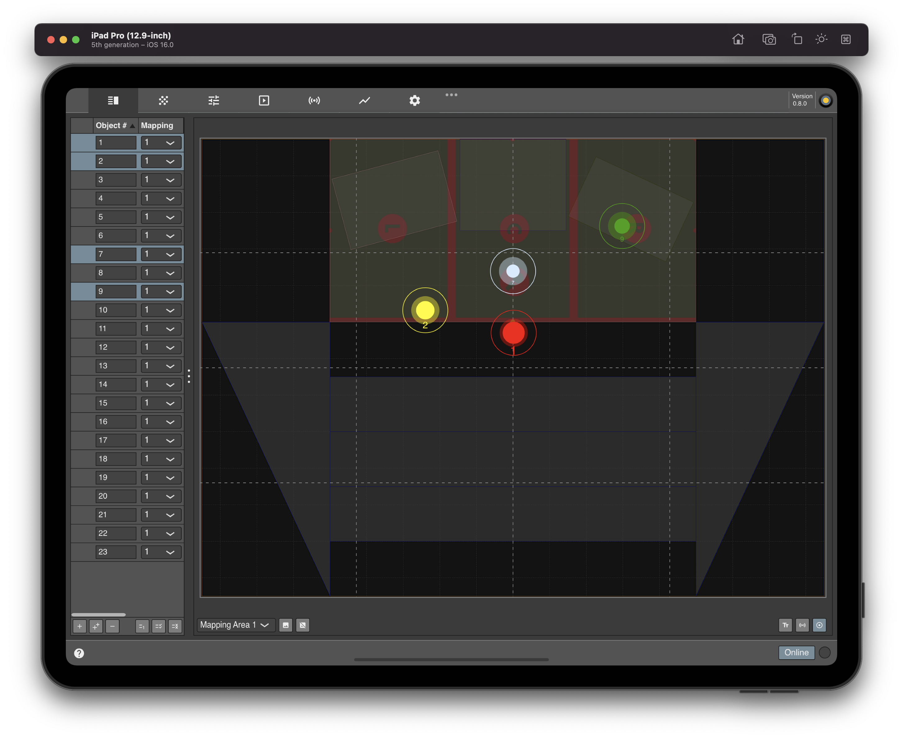
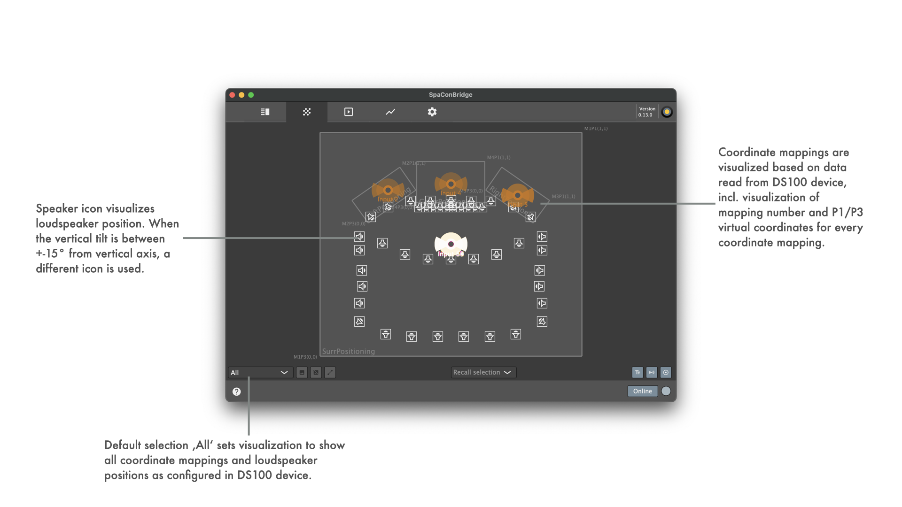
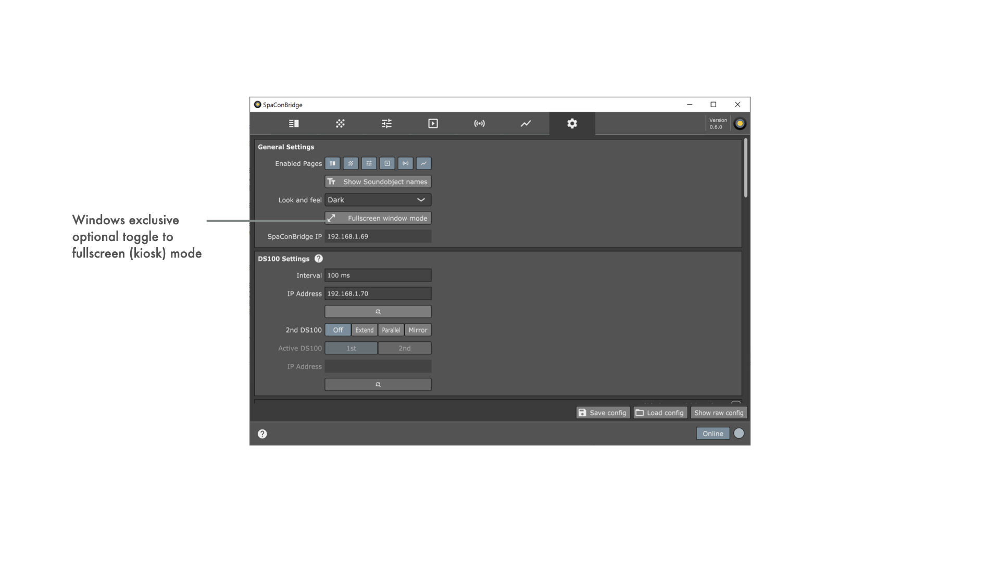

SpaConBridge (Spatial Control Bridge) is a **PRIVATELY** created and driven project.

Its sourcecode and prebuilt binaries are made publicly available to enable interested users to experiment, extend and create own adaptations.

There is no guarantee for compatibility inbetween versions or for the implemented functionality to be reliable for professional use at all. Use what is provided here at your own risk!

See [LATEST RELEASE](../../releases/latest) for available binary packages or join iOS TestFlight Beta:

|Appveyor CI build|Status|
|:----------------|:-----|
|Windows Visual Studio|  |
|macOS Xcode|  |
|Linux makefile|  |

**Supported plattforms**

<table>
<tr>
<th>iPhoneOS</th>
<th>iPadOS</th>
</tr>
<tr>
<td></td>
<td></td>
</tr>
<tr>
<th>macOS</th>
<th>Windows</th>
</tr>
<tr>
<td></td>
<td></td>
</tr>
<tr>
<th>Linux</th>
<th>Raspberry Pi OS (Raspbian)</th>
</tr>
<tr>
<td></td>
<td></td>
</tr>
</table>

SpaConBridge was created with the idea in mind to have both a simple ui to monitor or control Sound Object parameters of a d&b audiotechnik Soundscape system, esp. the DS100 Signal Engine, via OSC or AES70/OCP.1 protocol and at the same time the option to integration external control (MIDI device, OSC control app, ...).

It is neither suppported nor driven by official d&b activities.

**Known Issues:**
* MIDI device listing is not updated during runtime  
__Note:__ In consequence, devices being plugged in / coming online while app is running cannot be used unless app is restarted

<a name="toc" />

## Table of contents

* [Quick Start](#quicksetup)
* [App Architecture](#architectureoverview)
* [UI details](#uidetails)
  * [Sound Object Table](#soundobjecttable)
    * [Selective Sound Object muting](#soundobjectmuting)
    * [Sound Object Parameter editing](#soundobjectparameterediting)
  * [Multi Sound Object XY Pad](#twodimensionalpositionslider)
  * [Matrix IO Table](#matrixiotable)
  * [Scenes](#scenes)
  * [En-Space](#enspace)
  * [Statistics](#protocolbridgingtrafficloggingandplotting)
  * [Settings](#appsettings)
    * [Bridging protocols](#appsettingsprotocols)
* [Supported Sound Object parameters on UI](#soundobjectuiparameters)
* [Supported Matrix Input parameters on UI](#matrixinputuiparameters)
* [Supported Matrix Output parameters on UI](#matrixoutputuiparameters)

<a name="quicksetup" />

## Quick Start

1. _If no DS100 is available, the option to use 'None' as protocol communication dummy allows testing of bridging inbetween 3rd party devices and is supporting of loading a d&b dbpr project to extract the coordinate mapping setup and speaker system layout for visualization of object positions._
2. Launch SpaConBridge
3. [Settings](#appsettings) tab is opened as starting page
4. Set up the DS100 connection
    * Click on discovery button below IP address text edit field to get a list of devices that announce _osc._udp (DS100 OSC communication active) or _oca._tcp (DS100 OCP1/AES70 communication active) zeroconf service and choose the DS100 you want to connect to
    * If you do not have a DS100 at hand, now is the time to switch to 'None' as protocol and if available load the dbpr project to work with
5. Activate the 'Online' button in the lower right corner of the application window
6. 'Online' inidicator on bottom right of the UI becomes active
7. Go to [Sound Object Table](#soundobjecttable) tab
    * Add the Sound Objects you want to control data bridging behaviour for by clicking the 'Add' button
4. Receiving object values from DS100 is active by default (button with 'incoming' arrow symbol is toggled on)
8. Go to [Statistics](#protocolbridgingtrafficloggingandplotting) tab and click on DS100 legend item to activate DS100 protocol traffic plotting/logging.
9. Go to [Sound Object Table](#soundobjecttable) tab and select one of the Sound Objects for which you previously activated receiving object values (button with 'incoming' arrow symbol)
10. Details editor is opened for the Sound Object and shows live object value changes
11. Go to [Multi Sound Object XY Pad](#twodimensionalpositionslider) tab to see the live object value changes for all objects with activated value receiving
12. You now can set up a bridging protocol in [Settings](#appsettings) tab if you like, following instructions provided for each individual [implemented protocol](#appsettingprotocols)
    * Keep in mind that incoming protocol values are only forwarded to DS100 and not directly shown on UI. The updated values are shown on UI as soon as values are reflected by DS100. Without a working connection to DS100 device or simulation, the UI will not show external/3rdParty changes.
    * [Statistics](#protocolbridgingtrafficloggingandplotting) tab shows bridging traffic and therefor can be used to monitor incoming protocl values without a working connection to DS100 device or simulation.

<a name="architectureoverview"/>

## App architecture

Some details on SpaConBridge app architecture see [app architecture diagram](ARCHITECTURE.md)

<a name="uidetails" />

## UI details

<a name="soundobjecttable" />

### Sound Object Table

Every row in the table corresponds to an active Sound Object, meaning that it is shown on UI and its values can be received from DS100. This does not affect the pure protocol bridging in underlying module. E.g. in case an external OSC input sends new positioning values for a channel that is not present in the table, the values will still be bridged to DS100. This needs to be kept in mind if muting the input data from a protocol for a Sound Object is desired!
The table allows multiselection and editing of receive, send and mapping area selection for multiple Sound Objects at a time.

<a name="soundobjectmuting" />

For every active bridging protocol, a sub column with mute buttons is presented in 'Bridging' column. This allows muting individual data input related to a Sound Object coming in from bridging protocols.
Table multiselection allows editing of mute state for multiple Sound Objects and bridging protocols at a time.

<a name="soundobjectparameterediting" />

Following the selection in Sound Object table, the corresponding Soundscape parameters are shown in an editing area.
The UI layout is designed to adapt to the available screen real estate of the device SpaConBridge is used on. Depending on the screen geometry a vertical or horizontal layout of table and parameter editing area is used. 

On small screens, legend annotation and control value displays are hidden. (useful for Tablet landscape vs. portrait rotation, small Smartphone screens, embedded device touchscreens, ...)

The selection in Sound Object table and the currently active tab can be externally controlled by bridging protocols that support the commands 'SpaConBridge Sound Object Select' and 'SpaConBridge UI Element Index Select'.

The table control bar contains a toggle button that allows switching between single- and multiselection mode of the table. Depending on the mode, either the single sound object editor is shown on the right (horizontal layout) or below (vertical layout) or the multi sound object visualization area is shown. In case the latter is shown, only those sound objects that are selected in the table are visible.

A dropdown menu below the multiselection visualization area can be used to store the current multiselection with a given name for later recalling. All stored multiselections are listed in the dropdown menu for recalling and can also be cleared here.

<a name="twodimensionalpositionslider" />

### Multi Sound Object XY Pad

When 'All' is selected in the mapping area dropdown, all SoundObjects that are configured in SoundObjects table, are shown alongside a visual representation of loudspeaker positions and coordinate mappings as are configured in the connected DS100 device.

When a specific coordinate mapping is selected in the mapping area dropdown, only the Soundobjects that are setup respectively in the Soundobjects table are shown. The selection / multiselection in SoundObject table is followed here and reflected in SoundObject circle sizing - selected objects are shown enlarged.

A custom background image can be assigned for each of the four mapping areas.
Visualization of the MatrixInput ChannelName corresponding to the SoundObject can be activated with a toggle button in the lower right corner of the page.

Visualization of the En-Space send gain per SoundObject can be activated with a toggle button in the lower right corner of the page. The value is represented by 'wing' like reverberation elements on the right and left side of each SoundObject.

On devices that support multitouch input, a horizontal pinch gesture can be used to modify the En-Space send gain value. The gesture should be performed by first touching the sound object that shall be modified with a finger and then use a second finger to drag left or right. Dragging to the right increases the value, to the left decreases it.

Alternatively the mode can be used with a keyboard+mouse setup as well by clicking on the sound object to be modified, then pressing the ALT key on the keyboard and dragging the mouse while still pressing the primary mousekey.

Visualization of the Spread factor per SoundObject can be activated with a toggle button in the lower right corner of the page. The value is represented by transparent circles around each SoundObject.

On devices that support multitouch input, a vertical pinch gesture can be used to modify the Spread Factor value. The gesture should be performed by first touching the sound object that shall be modified with a finger and then use a second finger to drag up or down. Dragging up increases the value, down decreases it.

Alternatively the mode can be used with a keyboard+mouse setup as well by clicking on the sound object to be modified, then pressing the ALT key on the keyboard and dragging the mouse while still pressing the primary mousekey.

Extended SoundObject multiselection visualization and interaction can be activated with a toggle button in the lower button bar.
When enabled, the currently active multiselection of Sound Objects can be moved, rotated and scaled using the two interaction-handles. The Sound Objects part of the currently active multiselection are visualized with connecting lines.

<a name="matrixiotable" />

### Matrix Inputs/Outputs Table

On the left side (landscape) or top (portrait) of the page, a table for visualization and control of DS100 matrix input channels is shown and on the right side or bottom of the page, a table for matrix outputs.
Every row in both of the tables corresponds to an active Matrix Input or Output, meaning that it is shown on UI and its values can be received from DS100. This does not affect the pure protocol bridging in underlying module. E.g. in case an external OSC input sends new gain values for a channel that is not present in the table, the values will still be bridged to DS100. This needs to be kept in mind if muting the input data from a protocol for a Matrix Input/Output is desired!

<a name="scenes" />

### Scenes

Scenes page constantly reads the currently active Scene Index, Name and Comment from DS100 (low refresh rate) and displays the values in text editors.

The editor value for Scene Index can be edited by the user and used to trigger recalling the Scene specified by the index with a dedicated 'Recall' button. In addition to that, buttons for recalling previous and next scene directly are available.

A separate button allows 'pinning' a Scene for direct recall.
Clicking the button appends a direct recall entry for the Scene Index + Name currently active below the existing UI elements.
Direct recall entries must be unique, therefor a direct recall entry for a Scene Index can exist only once in the list of pinned Scenes. Removing a pinned Scene is possible through the right-aligned delete button for every entry.

<a name="enspace" />

### En-Space

En-Space page constantly reads the currently active room id, predelay factor and rear level values and displays them on UI.
The values can be modified by the user through given UI elements.

<a name="protocolbridgingtrafficloggingandplotting" />

### Statistics

Statistics page shows a graphical representation for current bridging protocol load (messages per second) for every active protocol and a tabular log view of the last 200 received messages. The graphical representation shown describes the raw incoming data rate only and contains no information on actual bridging.
Both plot and log are refreshed at a small rate to keep the performance impact on the host system resources low.

<a name="appsettings" />

### Settings

Settings page is structured in sections.

The first section allows configuration of application related parameters and is always active.
The pages that are visible as tabs on the UI can be set (exception Settings tab, must always be visible) using toggle buttons for every page and the UI look and feel (dark vs. light) can be selected from a dropdown.

DS100 OSC communication protocol is always active. The IP address can be manually configured or, if the build of SpaConBridge for the host system supports this, zeroconf discovery button can be used to select on of the discovered devices. OSC UDP communication ports are hardcoded to match the ones used by DS100.

<a name="appsettingsprotocols" />

#### Implemented bridging protocols

The following sections contain configuration details for the supported remote control protocols.

For details on the settings for the implemented protocols, see the individual documentation
  * [d&b DS100 signal bridge communication](Resources/Documentation/BridgingProtocols/DS100.md)
  * [Generic d&b OSC protocol communication](Resources/Documentation/BridgingProtocols/GenericOSC.md)
  * [d&b DAW plugin communication](Resources/Documentation/BridgingProtocols/DAWPlugin.md)
  * [DiGiCo SD series mixing console communication](Resources/Documentation/BridgingProtocols/DiGiCoOSC.md)
  * [Blacktrax tracking system communication](Resources/Documentation/BridgingProtocols/BlacktraxRTTrPM.md)
  * [Generic MIDI communication](Resources/Documentation/BridgingProtocols/GenericMIDI.md)
  * [Yamaha OSC communication *](Resources/Documentation/BridgingProtocols/YamahaOSC.md)
  * [ADM OSC communication *](Resources/Documentation/BridgingProtocols/ADMOSC.md)
  * [Customized OSC communication *](Resources/Documentation/BridgingProtocols/RemapOSC.md)
  
  &ast; Implemented using simulation only -> feature level 'Alpha'/'Beta'.

The bottom bar of settings page contains buttons to save and load entire SpaConBridge configurations, as well as a button to show the raw current configuration in a text editor overlay. The latter is mainly useful for debugging purposes.
Depending on the available horizontal UI resolution, buttons are hidden. 'Show raw config' disappears first, since it is least relevant for use. On host devices as smartphones, rotating from portrait to landscape mode can help to make the buttons visible, in case they are hidden in portrait mode.

<a name="soundobjectuiparameters" />

## Supported Soundscape parameters on UI

- Absolute Sound Object Position XY
- Matrix Input ReverbSendGain
- Sound Object Spread
- Sound Object Delay Mode
- Matrix Input ChannelName

<a name="matrixinputuiparameters" />

## Supported Matrix Input parameters on UI

- Matrix Input Level (pre mute)
- Matrix Input Gain
- Matrix Input Mute

<a name="martixoutputuiparameters" />

## Supported Matrix Output parameters on UI

- Matrix Output Level (post mute)
- Matrix Output Gain
- Matrix Output Mute
