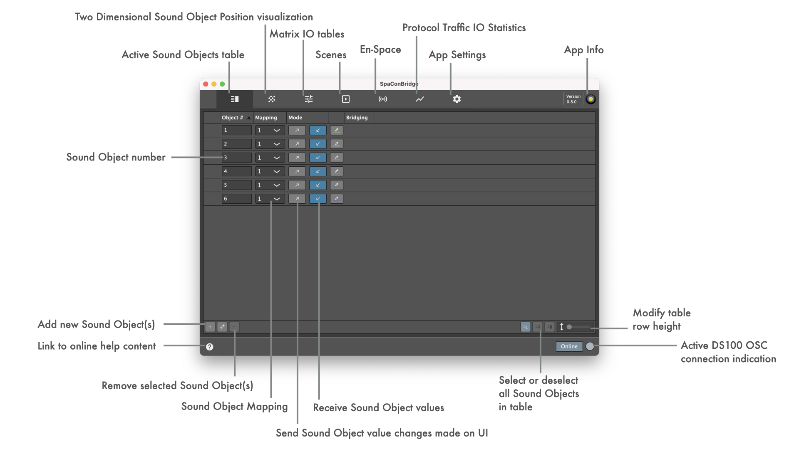
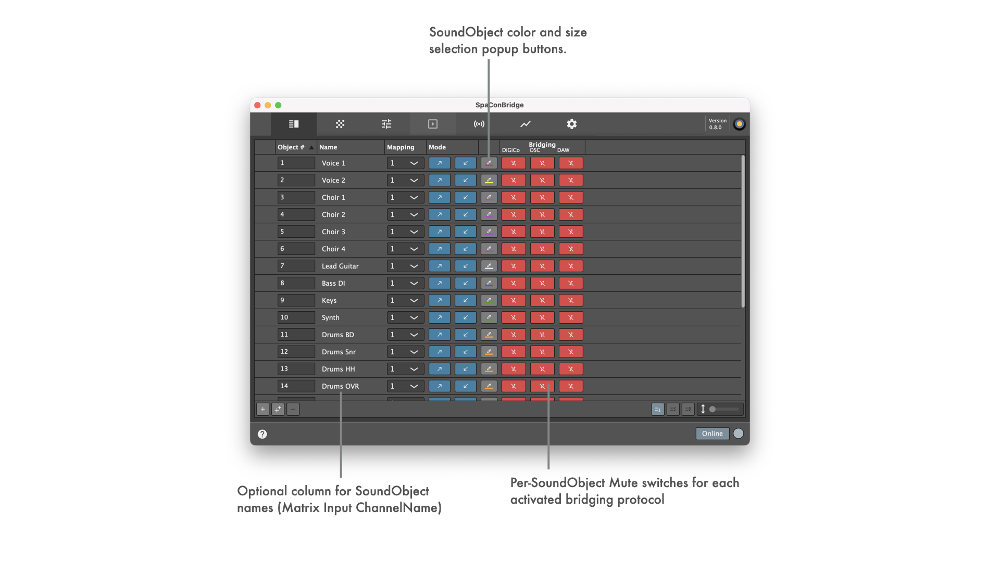
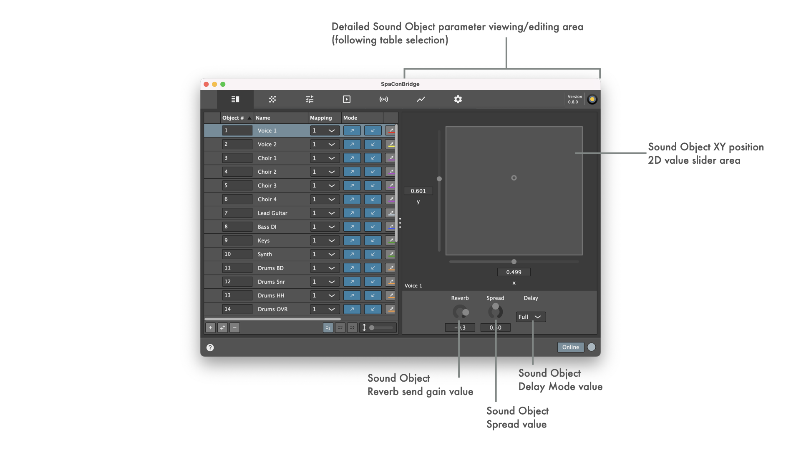

SoundscapeBridgeApp is currently in **EXPERIMENTAL** development.

Its sourcecode and prebuilt binaries are made publicly available to enable interested users to experiment, extend and create own adaptations.

There is no guarantee for compatibility inbetween versions or for the implemented functionality to be reliable for professional use at all. Use what is provided here at your own risk!

See [LATEST RELEASE](../../releases/latest) for available binary packages.

SoundscapeBridgeApp is created with the idea in mind to have both a simple ui to monitor or control Sound Object parameters of a d&b audiotechnik Soundscape system, esp. the DS100 Signal Engine, via OSC protocol and at the same time the possibility of controlling interfacing with external control data input (MIDI device, OSC control app, ...).

SoundscapeBridgeApp is a project inspired by d&b audiotechnik GmbH & Co. KG's own "Soundscape DAW Plugin" made publicly available at https://github.com/dbaudio-soundscape/db-Soundscape-DAW-Plugins and "Soundscape Control with DiGiCo SD consoles" made publicly available at https://github.com/dbaudio-soundscape/db-Soundscape-control-with-DiGiCo-SD-Consoles.

**Known Issues:**

* The app freezes when configuration is changed while data is received (freezes the longer, the more Sound Objects are active)  
__Note:__ Major code refactoring is required to solve this
* Zeroconf is not working in builds for Windows OS  
__Note:__ Needs to be implemented...
* LookAndFeel change does not reliably update colour scheme for all UI elements  
__Note:__ Suspicion: Underlying UI framework issue is the cause for this
* MIDI device listing is not updated during runtime  
__Note:__ In consequence, devices being plugged in / coming online while app is running cannot be used unless app is restarted

<a name="toc" />

## Table of contents

* [Quick Start](#quicksetup)
* [UI details](#uidetails)
  * [Sound Object Table](#soundobjecttable)
    * [Selective Sound Object muting](#soundobjectmuting)
    * [Sound Object Parameter editing](#soundobjectparameterediting)
  * [Multi Sound Object XY Pad](#twodimensionalpositionslider)
  * [Statistics](#protocolbridgingtrafficloggingandplotting)
  * [Settings](#appsettings)
* [Supported Sound Object parameters on UI](#uiparameters)

<a name="quicksetup" />

## Quick Start

1. If no DS100 is available, the minimal simulation tool [SoundscapeOSCSim](https://github.com/ChristianAhrens/SoundscapeOSCSim) or the generic bridging tool [RemoteProtocolBridgeUI](https://github.com/ChristianAhrens/RemoteProtocolBridgeUI) can be used for testing and debugging.
2. Launch SoundscapeBridgeApp
    * Sound Object table has no entries, no bridging protocol is active
    * App is 'offline' since no Sound Object is active
3. Add some Sound Objects by clicking the 'Add' button
4. Enable receiving object values from DS100 by toggling the button with 'incoming' arrow symbol for at least one Sound Object in the table
5. Go to [Settings](#appsettings) tab
    * If you do not have a DS100 at hand, now is the time to launch [SoundscapeOSCSim](https://github.com/ChristianAhrens/SoundscapeOSCSim) simulation tool
6. Set up the DS100 connection
    * iPhoneOS/iPadOS/macOS: Click on discovery button below IP address text edit field to get a list of devices that announce _osc._udp zeroconf service and choose the DS100 or [SoundscapeOSCSim](https://github.com/ChristianAhrens/SoundscapeOSCSim) simulation tool you want to connect to
    * Windows: Enter the IP address of the DS100 or [SoundscapeOSCSim](https://github.com/ChristianAhrens/SoundscapeOSCSim) simulation tool you want to connect to manually
7. 'Online' inidicator on bottom right of the UI becomes active
    * If using SoundscapeOSCSim, adjust the refresh rate slider on the tool's UI to the desired interval (= object value change speed). The tool's UI displays current object value polling rate in the performance metering.
8. Go to [Statistics](#protocolbridgingtrafficloggingandplotting) tab and click on DS100 legend item to activate DS100 protocol traffic plotting/logging.
9. Go to [Sound Object Table](#soundobjecttable) tab and select one of the Sound Objects for which you previously activated receiving object values (button with 'incoming' arrow symbol)
10. Details editor is opened for the Sound Object and shows live object value changes
11. Go to [Multi Sound Object XY Pad](#twodimensionalpositionslider) tab to see the live object value changes for all objects with activated value receiving
13. Go to [Sound Object Table](#soundobjecttable) tab, select a Sound Object and enable sending object values to DS100 by toggling the button with 'outgoing' arrow symbol
    * When modifying the x, y, Reverb, Spread and Mode values through UI, they are now sent to DS100. Note: When using [SoundscapeOSCSim](https://github.com/ChristianAhrens/SoundscapeOSCSim), set its update interval to 0, otherwise it will immediately update the just sent value with a new simulated value.
14. You now can set up a bridging protocol in [Settings](#appsettings) tab if you like, following instructions provided for each individual [implemented protocol](#appsettingprotocols)
    * Keep in mind that incoming protocol values are only forwarded to DS100 and not directly shown on UI. The updated values are shown on UI as soon as values are reflected by DS100. Without a working connection to DS100 device or simulation, the UI will not show the changes.
    * [Statistics](#protocolbridgingtrafficloggingandplotting) tab shows bridging traffic and therefor can be used to monitor incoming protocl values without a working connection to DS100 device or simulation.

<a name="uidetails" />

## UI details

<a name="soundobjecttable" />

### Sound Object Table

<a name="soundobjectmuting" />

<a name="soundobjectparameterediting" />

<a name="twodimensionalpositionslider" />

### Multi Sound Object XY Pad

<a name="protocolbridgingtrafficloggingandplotting" />

### Statistics

<a name="appsettings" />

### Settings

<a name="appsettingsprotocols" />

For details on the settings for the implemented protocols, see the individual documentation
  * [d&b DS100 signal bridge communication](Resources/Documentation/BridgingProtocols/DS100.md)
  * [DiGiCo SD series mixing console communication](Resources/Documentation/BridgingProtocols/DiGiCoOSC.md)
  * [Blacktrax tracking system communication *](Resources/Documentation/BridgingProtocols/BlacktraxRTTrPM.md)
  * [Generic d&b OSC protocol communication](Resources/Documentation/BridgingProtocols/GenericOSC.md)
  * [Generic MIDI communication](Resources/Documentation/BridgingProtocols/GenericMIDI.md)
  * [Yamaha OSC communication *](Resources/Documentation/BridgingProtocols/YamahaOSC.md)
  
  &ast; Implemented with simulated devices only, entirely untested with real ones.

<a name="uiparameters" />

## Supported Soundscape parameters on UI

- Absolute Sound Object Position XY
- Matrix Input ReverbSendGain
- Sound Object Spread
- Sound Object Delay Mode
