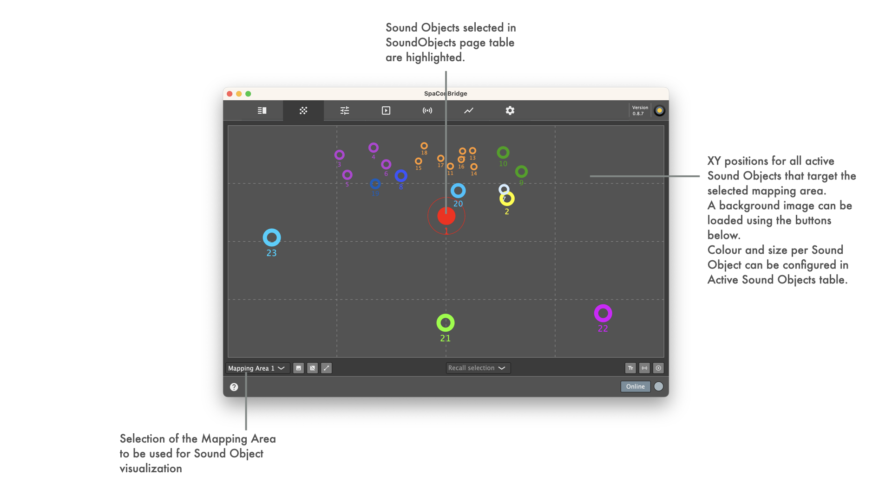
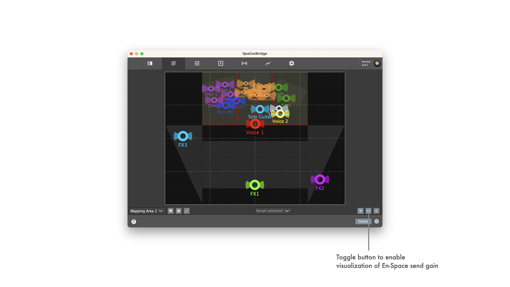

SoundscapeBridgeApp is currently in **BETA** development. Many things may still change until first production release.
See [LATEST RELEASE](../../releases/latest) for available binary packages.

SoundscapeBridgeApp is a project inspired by d&b audiotechnik GmbH & Co. KG's "Soundscape DAW Plugin" made publicly available at https://github.com/dbaudio-soundscape/db-Soundscape-DAW-Plugins and d&b audiotechnik GmbH & Co. KG's "Soundscape Control with DiGiCo SD consoles" made publicly available at https://github.com/dbaudio-soundscape/db-Soundscape-control-with-DiGiCo-SD-Consoles.

The idea is to have a multi-platform application with a user interface that allows viewing and editing of Sound Object parameters of a d&b audiotechnik Soundscape system based on DS100 signal bridge, while also integrating the capability of third party control translation to d&b audiotechnik OSC protocol to externally control Sound Object parameters.

* [Features overview](#featurebrief)
* [Sound Object Table page](#soundobjecttable)
  * [Selective Sound Object muting](#soundobjectmuting)
  * [Sound Object Parameter editing](#soundobjectparameterediting)
* [2D Position Slider page](#twodimensionalpositionslider)
* [Protocol Bridging traffic logging and plotting page](#protocolbridgingtrafficloggingandplotting)
* [App Settings page](#appsettings)
  * [DS100 communication](#ds100settings)
  * [DiGiCo bridging](#digicosettings)
  * [Blacktrax bridging](#blacktraxsettings)
  * [Generic OSC bridging](#genericoscsettings)
  * [UI LookAndFeel](#lookandfeelsettings)
* [Supported Sound Object parameters on UI](#uiparameters)
* [Supported Sound Object parameters for protocol bridging](#bridgingparameters)

<a name="featurebrief" />

## Features 

* Monitoring of Soundscape Sound Object parameters
* Protocol bridging from 3rd party devices/applications to d&b DS100 signal bridge
* Monitoring of protocol bridging performance in graphical and textual representation
* Tab based user interface containing tabs for
  * Active Sound Objects in tabular form with dedicated controls for an object's parameters following table selection 
  * Comprehensive two dimensional slider surface for viewing and controlling of all active Sound Objects 
  * Bridging traffic logging and plotting for active bridging protocols
  * Application settings
* Support for iOS/iPadOS/MacOS/Windows plattforms through using JUCE Framework

<a name="soundobjecttable" />

## Sound Object Table

<a name="soundobjectmuting" />

<a name="soundobjectparameterediting" />

<a name="twodimensionalpositionslider" />

## Two Dimensional position slider

<a name="protocolbridgingtrafficloggingandplotting" />

## Protocol Bridging traffic logging and plotting

<a name="appsettings" />

## App settings

<a name="ds100settings" />

### DS100 settings

<a name="digicosettings" />

### DiGiCo bridging settings

<a name="blacktraxsettings" />

### Blacktrax RTTrPM bridging settings

<a name="genericoscsettings" />

### Generic OSC bridging settings

<a name="lookandfeelsettings" />

### App LookAndFeel settings

<a name="uiparameters" />

### Supported Soundscape parameters on UI

- Absolute Sound Object Position XY
- Matrix Input ReverbSendGain
- Sound Object Spread
- Sound Object Delay Mode

<a name="bridgingparameters" />

### Supported Soundscape parameters for protocol bridging

- Device Name
- General Error
- Error Text
- Status Text
- Matrix Input Mute
- Matrix Input Gain
- Matrix Input Delay
- Matrix Input DelayEnable
- Matrix Input EqEnable
- Matrix Input Polarity
- Matrix Input ChannelName
- Matrix Input LevelMeterPreMute
- Matrix Input LevelMeterPostMute
- Matrix Node Enable
- Matrix Node Gain
- Matrix Node DelayEnable
- Matrix Node Delay
- Matrix Output Mute
- Matrix Output Gain
- Matrix Output Delay
- Matrix Output DelayEnable
- Matrix Output EqEnable
- Matrix Output Polarity
- Matrix Output ChannelName
- Matrix Output LevelMeterPreMute
- Matrix Output LevelMeterPostMute
- Sound Object Spread
- Sound Object Delay Mode
- Absolute Sound Object Position XYZ
- Absolute Sound Object Position XY
- Absolute Sound Object Position X
- Absolute Sound Object Position Y
- Mapped Sound Object Position XYZ
- Mapped Sound Object Position XY
- Mapped Sound Object Position X
- Mapped Sound Object Position Y
- Matrix Settings ReverbRoomId
- Matrix Settings ReverbPredelayFactor
- Matrix Settings ReverbRearLevel
- Matrix Input ReverbSendGain
- Reverb Input Gain
- Reverb Input Processing Mute
- Reverb Input Processing Gain
- Reverb Input Processing LevelMeter
- Reverb Input Processing EqEnable
- Device Clear
- Scene Previous
- Scene Next
- Scene Recall
- Scene SceneIndex
- Scene SceneName
- Scene SceneComment