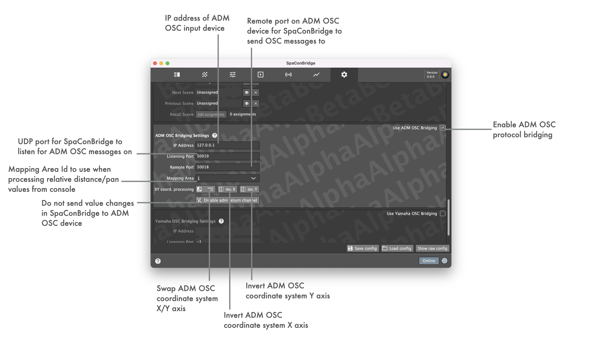

## ADM OSC bridging settings

**ADM OSC bridging support is in a development testing state - if you are interested in this functionality and have the means to try it out, feedback is welcome!**

### Implemented OSC messages

_* Incoming polar and cartesian coordinate values are buffered in an internal value cache. This is required to be able to process incoming polar coordinate values to the required internal cartesian remote object values._

| ADM OSC input | Internal remote object | |
| -- | -- | -- |
| _/adm/obj/[CH]/azim_ | Combined Mapped Sound Object Position XY | _DS100 target mapping area id is filled in from config_ |
| _/adm/obj/[CH]/elev_ | Combined Mapped Sound Object Position XY | _DS100 target mapping area id is filled in from config_ |
| _/adm/obj/[CH]/dist_ | _not used_ |  |
| _/adm/obj/[CH]/aed_ | Combined Mapped Sound Object Position XY | _DS100 target mapping area id is filled in from config_ |
| _/adm/obj/[CH]/x_ | Combined Mapped Sound Object Position XY | _DS100 target mapping area id is filled in from config_ |
| _/adm/obj/[CH]/y_ | Combined Mapped Sound Object Position XY | _DS100 target mapping area id is filled in from config_ |
| _/adm/obj/[CH]/z_ | _not used_ |  |
| _/adm/obj/[CH]/xyz_ | Combined Mapped Sound Object Position XY | _DS100 target mapping area id is filled in from config_ |
| _/adm/obj/[CH]/gain_ | Matrix Input Gain | |
| _/adm/obj/[CH]/w_ | Sound Object Spread | |
| _/adm/config/obj/1/cartesian_ | | _Triggers sync of internal cache contents (cartesian->polar or polar->cartesian)_ |