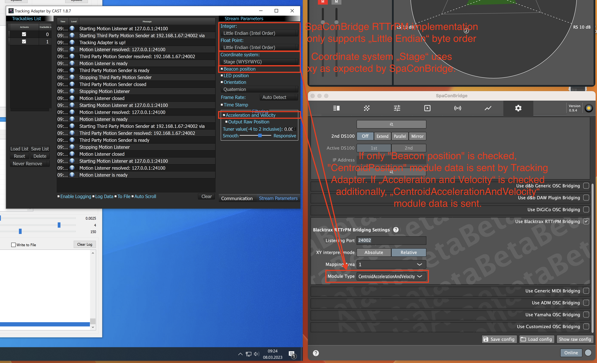

## BlackTrax RTTrPM bridging settings

Minimal demo video for example setup with BlackTrax simulation software (Simulator software package can be obtained from BlackTrax at https://blacktrax.cast-soft.com/developer/):

__

### Tracker simulation network connection setup

### Tracker simulation protocol contents setup

### Beacon Index to Soundobject mapping

### Implemented Soundscape remote objects for protocol bridging

| RTTrPM packet module | Internal remote object | |
| -- | -- | -- |
| _TrackedPointPosition_ | Soundobject Position XY* |
| _TrackedPointAccelerationAndVelocity_ | Soundobject Position XY* |
| _CentroidPosition_ | Soundobject Position XY* |
| _CentroidAccelerationAndVelocity_ | Soundobject Position XY* |
| _OrientationQuaternion_ | _not used_ |
| _OrientationEuler_ | _not used_ |
| _ZoneCollisionDetection_ | _not used_ |

*Depending on MappingAreaId config, mapped Soundobject position XY **or** absolute Soundobject position XY objects are generated