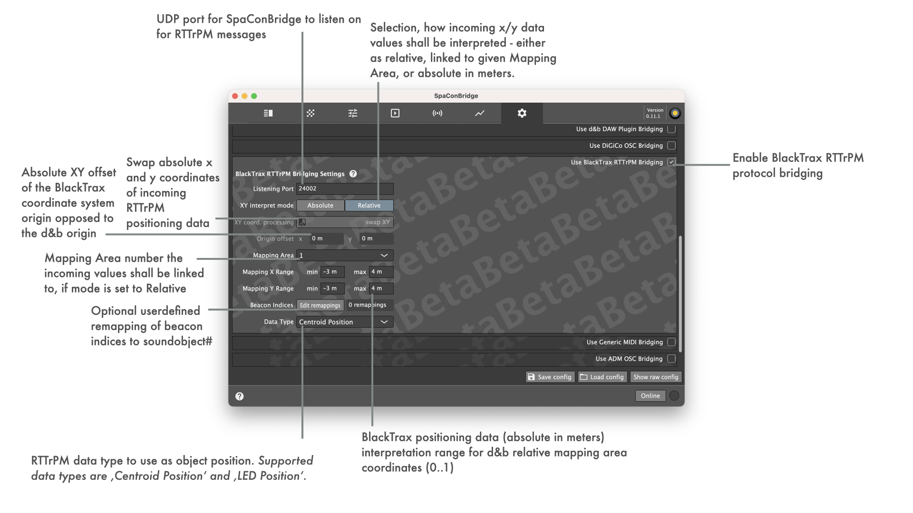
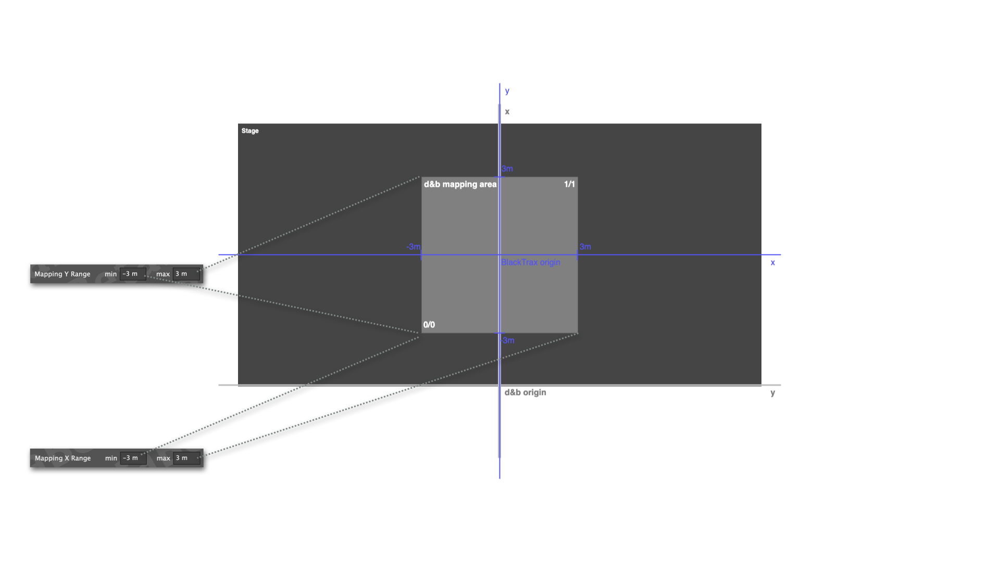

## BlackTrax RTTrPM bridging settings

### Tracker 'Network' config

### Tracker 'Advanced' config

### Beacon Index to Soundobject mapping

Beacon indices to Soundobject mapping default is 1:1, meaning positioning information for Beacon one is interpreted and forwarded as position for Soundobject one.
This optionally can be changed using the 'Edit remappings' option, where the mapping from Beacons to Soundobjects can be modified in a table. Any Beacon index entry in the table maps that very Beacons positioning information to the configured Soundobject. For any Beacon not configured in the table, the default 1:1 mapping is used.

### Implemented Soundscape remote objects for protocol bridging

| RTTrPM packet module | Internal remote object | |
| -- | -- | -- |
| _TrackedPointPosition_ | Soundobject Position XY* |
| _TrackedPointAccelerationAndVelocity_ | Soundobject Position XY* |
| _CentroidPosition_ | Soundobject Position XY* |
| _CentroidAccelerationAndVelocity_ | Soundobject Position XY* |
| _OrientationQuaternion_ | _not used_ |
| _OrientationEuler_ | _not used_ |
| _ZoneCollisionDetection_ | _not used_ |

*Depending on MappingAreaId config, mapped Soundobject position XY **or** absolute Soundobject position XY objects are generated