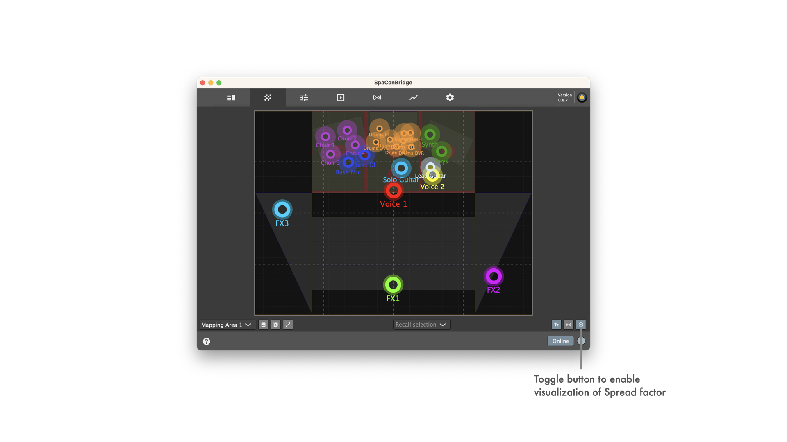

## Blacktrax RTTrPM bridging settings

### Supported Soundscape parameters for protocol bridging

| RTTrPM packet module | Internal remote object | |
| -- | -- | -- |
| _TrackedPointPosition_ | Mapped Sound Object Position XY **or** Absolute Sound Object Position XY | _Depending on config, either absolute or relative object with DS100 target mapping area id filled in from config is used._ |
| _TrackedPointAccelerationAndVelocity_ | _not used_ | |
| _CentroidPosition_ | _not used_ | |
| _CentroidAccelerationAndVelocity_ | _not used_ | |
| _OrientationQuaternion_ | _not used_ | |
| _OrientationEuler_ | _not used_ | |
| _ZoneCollisionDetection_ | _not used_ | |