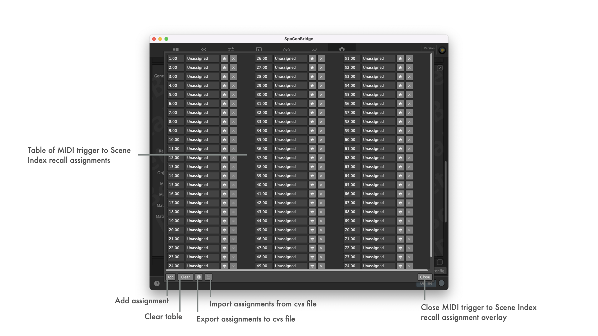

## DS100 settings

### Supported Soundscape remote objects on UI

- Mapped Sound Object Position X
- Mapped Sound Object Position Y
- Mapped Sound Object Position XY
- Matrix Input ReverbSendGain
- Sound Object Spread
- Sound Object Delay Mode
- Matrix Input ChannelName
- Matrix Input Level (pre mute)
- Matrix Input Gain
- Matrix Input Mute
- Matrix Output Level (post mute)
- Matrix Output Gain
- Matrix Output Mute

### Implemented Soundscape remote objects for protocol bridging *

&ast; String remote objects have not been tested at all. All others should work ok, but extensive testing is still pending.

- Device Name
- General Error
- Error Text
- Status Text
- Matrix Input Mute
- Matrix Input Gain
- Matrix Input Delay
- Matrix Input DelayEnable
- Matrix Input EqEnable
- Matrix Input Polarity
- Matrix Input ChannelName
- Matrix Input LevelMeterPreMute
- Matrix Input LevelMeterPostMute
- Matrix Node Enable
- Matrix Node Gain
- Matrix Node DelayEnable
- Matrix Node Delay
- Matrix Output Mute
- Matrix Output Gain
- Matrix Output Delay
- Matrix Output DelayEnable
- Matrix Output EqEnable
- Matrix Output Polarity
- Matrix Output ChannelName
- Matrix Output LevelMeterPreMute
- Matrix Output LevelMeterPostMute
- Sound Object Spread
- Sound Object Delay Mode
- Absolute Sound Object Position XYZ
- Absolute Sound Object Position XY
- Absolute Sound Object Position X
- Absolute Sound Object Position Y
- Mapped Sound Object Position XYZ
- Mapped Sound Object Position XY
- Mapped Sound Object Position X
- Mapped Sound Object Position Y
- Matrix Settings ReverbRoomId
- Matrix Settings ReverbPredelayFactor
- Matrix Settings ReverbRearLevel
- Matrix Input ReverbSendGain
- Reverb Input Gain
- Reverb Input Processing Mute
- Reverb Input Processing Gain
- Reverb Input Processing LevelMeter
- Reverb Input Processing EqEnable
- Device Clear
- Scene Previous
- Scene Next
- Scene Recall
- Scene SceneIndex
- Scene SceneName
- Scene SceneComment