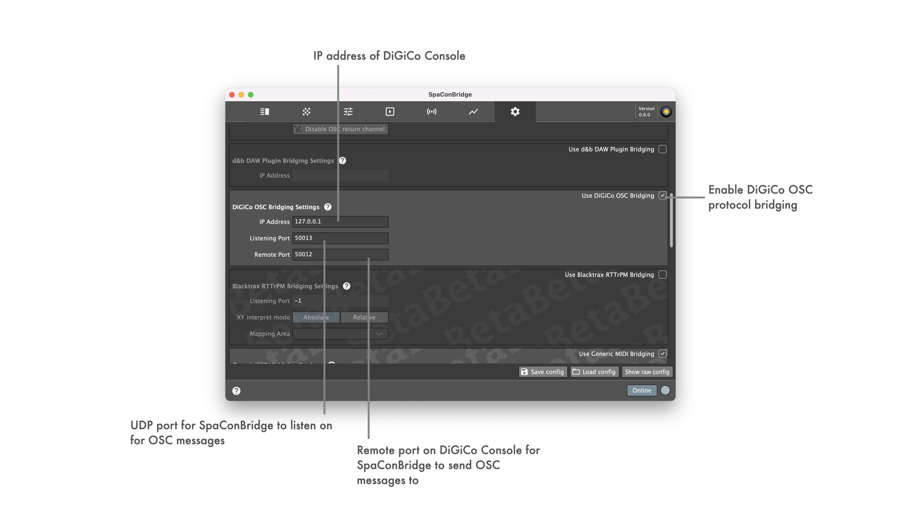

## Generic MIDI bridging settings

Assignment of mapping between MIDI input commmands and internal Soundscape parameters is done using the provided 'MIDI learner' training functionality.
This can be activated clicking on the learner trigger buttons and brings up a popup menu that lists the incoming MIDI data preprocessed into usable mapping types. Clearing the current assignment is possible with the dedicated Clear button per assignment.
| Mapping Type | |
| -- | -- |
| Single Trigger | Every incoming Note On/Off MIDI command is listed as single trigger. This is useful to map to Sound Object selection remote object, e.g. when using a MIDI controller device with multiple buttons that can be used to select a Sound Object in SoundscapeBridgeApp UI this way. |
| Value Range | Every incoming MIDI command that has a value attached to it is listed as value range mapping type - pitch wheel movement for example is listed here. A pitch wheel MIDI command can have values 0 to 16383. The listed mapping value range is extended every time a new pitch wheel command is received, that has a value exceeding the currently listed range bounds. Starting the learing with a pitch wheel value 8192, extending up to 16383, and using this as mapping to Sound Object Spread will lead to the entire 0...1 spread range being controlled by upper half of pitch wheel rotation angle. |
| Command+Value Range | This is an extension of Value Range mappings. A new entry is generated whenn incoming MIDI commands are of the same command type. E.g. a MIDI device with multiple rotary controls that map to MIDI ctrl0, ctrl1, ctrl2, ... can be used to create a Command+Value Range mapping. When triggering the rotary for ctrl0 and ctrl1, a possible mapping spanning from ctrl0-ctrl1 is created. When triggering the rotary for ctrl2, the mapping span is extended to ctrl0-ctrl2. |

As soon as the desired MIDI mapping is learned, it can be selected from the listing and in consequence is assigned to the remote object. MIDI mappings currently cannot be cleared but only new ones selected as replacement. Deactivating the Generic MIDI bridging protocol and reactivating can be used as workaround, since this clears all learned assignments.

For internal Soundscape parameter 'Scene Recall' that refers to a dedicated Scene Index value (1.00 ... 99.999), a mapping between Scene Index values and MIDI input commands can be setup in an overlay UI accessible by clicking the 'Edit assignments' button for 'Recall Scene' Soundscape parameter.

_Minimal video tutorial for example setup with Allen&Heath Qu-16 Mixing Console as TCP/IP MIDI input/output (using Allen&Heath Midi Control utility https://www.allen-heath.com/midi-control/):_

_Minimal video tutorial for example setup with AKAI MPKmini2 as MIDI input:_

### Supported MIDI values/commands

| Internal remote object | Supported MIDI mapping type | |
| -- | -- | -- |
| SoundscapeBridgeApp Sound Object Select | _Single Trigger / Command+Value Range_ | Usable to externally (de-)select a sound object |
| Mapped Sound Object Position X | _Value Range / Command+Value Range_ | Object value range is 0...1, the learned range is mapped to this |
| Mapped Sound Object Position Y | _Value Range / Command+Value Range_ | Object value range is 0...1, the learned range is mapped to this |
| Matrix Input ReverbSendGain | _Value Range / Command+Value Range_ | Object value range is 0...1, the learned range is mapped to this |
| Sound Object Spread | _Value Range / Command+Value Range_ | Object value range is 0...1, the learned range is mapped to this |
| Sound Object Delay Mode | _Value Range / Command+Value Range_ | Object value range is 0...1, the learned range is mapped to this |