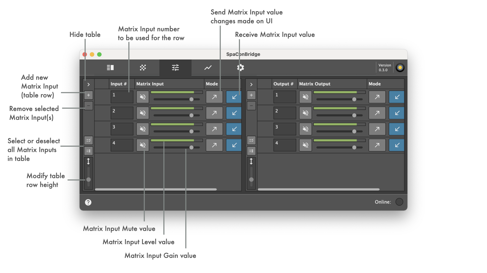

## Generic d&b OSC bridging settings

_This bridging protocol implementation is also used for communication with DS100 and follows d&b [DS100 OSC protocol specification](https://www.dbaudio.com/assets/products/downloads/manuals-documentation/electronics/dbaudio-osc-protocol-ds100-1.3.0-en.pdf). In addition to this, two OSC comands specific to SoundscapeBridgeApp are implemented ("/RemoteProtocolBridge/SoundObjectSelect", "/RemoteProtocolBridge/UIElementIndexSelect")._

_Minimal video tutorial for example setup with OSC input from OSControl software:_

### Supported OSC messages handled in app UI

| External OSC input | Internal remote object | |
| -- | -- | -- |
| _/dbaudio1/coordinatemapping/source_position_xy_ | Mapped Sound Object Position XY      |  |
| _/dbaudio1/matrixinput/reverbsendgain_ | Matrix Input ReverbSendGain          |  |
| _/dbaudio1/positioning/source_spread_ | Sound Object Spread                  |  |
| _/dbaudio1/positioning/source_delaymode_ | Sound Object Delay Mode              |  |
| _/RemoteProtocolBridge/SoundObjectSelect_ | SpaConBridge Sound Object Select | _Used to externally (de-)select a sound object_ |
| _/RemoteProtocolBridge/UIElementIndexSelect_ | SpaConBridge UI Element Index Select | _Used to externally switch between tabs_ |
| _/RemoteProtocolBridge/cachedValues_ | SpaConBridge value cache sending trigger | _Used to externally query all internally known cached object values_ |

### Implemented Soundscape remote objects for protocol bridging

| External OSC input | Internal remote object | |
| -- | -- | -- |
| _/dbaudio1/settings/devicename_ | Device Name
| _/dbaudio1/error/gnrlerr_ | General Error                        |  |
| _/dbaudio1/status/errortext_ | Error Text                           |  |
| _/dbaudio1/status/statustext_ | Status Text                          |  |
| _/dbaudio1/matrixinput/mute_ | Matrix Input Mute                    |  |
| _/dbaudio1/matrixinput/gain_ | Matrix Input Gain                    |  |
| _/dbaudio1/matrixinput/delay_ | Matrix Input Delay                   |  |
| _/dbaudio1/matrixinput/delayenable_ | Matrix Input DelayEnable             |  |
| _/dbaudio1/matrixinput/eqenable_ | Matrix Input EqEnable                |  |
| _/dbaudio1/matrixinput/polarity_ | Matrix Input Polarity                |  |
| _/dbaudio1/matrixinput/channelname_ | Matrix Input ChannelName             |  |
| _/dbaudio1/matrixinput/levelmeterpremute_ | Matrix Input LevelMeterPreMute       |  |
| _/dbaudio1/matrixinput/levelmeterpostmute_ | Matrix Input LevelMeterPostMute      |  |
| _/dbaudio1/matrixnode/enable_ | Matrix Node Enable                   |  |
| _/dbaudio1/matrixnode/gain_ | Matrix Node Gain                     |  |
| _/dbaudio1/matrixnode/delayenable_ | Matrix Node DelayEnable              |  |
| _/dbaudio1/matrixnode/delay_ | Matrix Node Delay                    |  |
| _/dbaudio1/matrixoutput/mute_ | Matrix Output Mute                   |  |
| _/dbaudio1/matrixoutput/gain_ | Matrix Output Gain                   |  |
| _/dbaudio1/matrixoutput/delay_ | Matrix Output Delay                  |  |
| _/dbaudio1/matrixoutput/delayenable_ | Matrix Output DelayEnable            |  |
| _/dbaudio1/matrixoutput/eqenable_ | Matrix Output EqEnable               |  |
| _/dbaudio1/matrixoutput/polarity_ | Matrix Output Polarity               |  |
| _/dbaudio1/matrixoutput/channelname_ | Matrix Output ChannelName            |  |
| _/dbaudio1/matrixoutput/levelmeterpremute_ | Matrix Output LevelMeterPreMute      |  |
| _/dbaudio1/matrixoutput/levelmeterpostmute_ | Matrix Output LevelMeterPostMute     |  |
| _/dbaudio1/positioning/source_spread_ | Sound Object Spread                  |  |
| _/dbaudio1/positioning/source_delaymode_ | Sound Object Delay Mode              |  |
| _/dbaudio1/positioning/source_position_ | Absolute Sound Object Position XYZ   |  |
| _/dbaudio1/positioning/source_position_xy_ | Absolute Sound Object Position XY    |  |
| _/dbaudio1/positioning/source_position_x_ | Absolute Sound Object Position X     |  |
| _/dbaudio1/positioning/source_position_y_ | Absolute Sound Object Position Y     |  |
| _/dbaudio1/coordinatemapping/source_position_ | Mapped Sound Object Position XYZ     |  |
| _/dbaudio1/coordinatemapping/source_position_xy_ | Mapped Sound Object Position XY      |  |
| _/dbaudio1/coordinatemapping/source_position_x_ | Mapped Sound Object Position X       |  |
| _/dbaudio1/coordinatemapping/source_position_y_ | Mapped Sound Object Position Y       |  |
| _/dbaudio1/matrixsettings/reverbroomid_ | Matrix Settings ReverbRoomId         |  |
| _/dbaudio1/matrixsettings/reverbpredelayfactor_ | Matrix Settings ReverbPredelayFactor |  |
| _/dbaudio1/matrixsettings/reverbrearlevel_ | Matrix Settings ReverbRearLevel      |  |
| _/dbaudio1/matrixinput/reverbsendgain_ | Matrix Input ReverbSendGain          |  |
| _/dbaudio1/reverbinput/gain_ | Reverb Input Gain                    |  |
| _/dbaudio1/reverbinputprocessing/mute_ | Reverb Input Processing Mute         |  |
| _/dbaudio1/reverbinputprocessing/gain_ | Reverb Input Processing Gain         |  |
| _/dbaudio1/reverbinputprocessing/levelmeter_ | Reverb Input Processing LevelMeter   |  |
| _/dbaudio1/reverbinputprocessing/eqenable_ | Reverb Input Processing EqEnable     |  |
| _/dbaudio1/device/clear_ | Device Clear                         |  |
| _/dbaudio1/scene/previous_ | Scene Previous                       |  |
| _/dbaudio1/scene/next_ | Scene Next                           |  |
| _/dbaudio1/scene/recall_ | Scene Recall                         |  |
| _/dbaudio1/scene/sceneindex_ | Scene SceneIndex                     |  |
| _/dbaudio1/scene/scenename_ | Scene SceneName                      |  |
| _/dbaudio1/scene/scenecomment_ | Scene SceneComment                   |  |