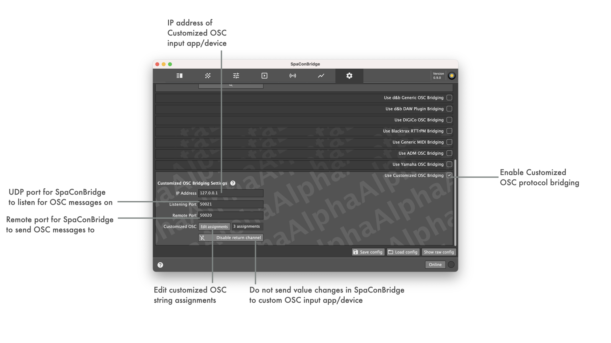
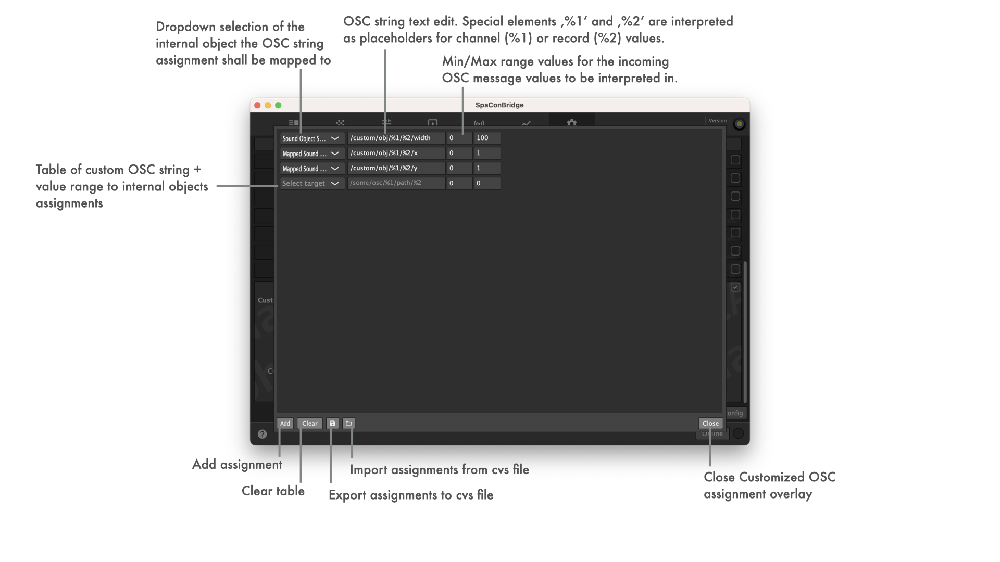

## Customized OSC bridging settings

### Available Soundscape remote objects for using as custom OSC assignment target

| Internal remote object | |
| -- | -- |
| Device Name
| General Error                        |  |
| Error Text                           |  |
| Status Text                          |  |
| Matrix Input Mute                    |  |
| Matrix Input Gain                    |  |
| Matrix Input Delay                   |  |
| Matrix Input DelayEnable             |  |
| Matrix Input EqEnable                |  |
| Matrix Input Polarity                |  |
| Matrix Input ChannelName             |  |
| Matrix Input LevelMeterPreMute       |  |
| Matrix Input LevelMeterPostMute      |  |
| Matrix Node Enable                   |  |
| Matrix Node Gain                     |  |
| Matrix Node DelayEnable              |  |
| Matrix Node Delay                    |  |
| Matrix Output Mute                   |  |
| Matrix Output Gain                   |  |
| Matrix Output Delay                  |  |
| Matrix Output DelayEnable            |  |
| Matrix Output EqEnable               |  |
| Matrix Output Polarity               |  |
| Matrix Output ChannelName            |  |
| Matrix Output LevelMeterPreMute      |  |
| Matrix Output LevelMeterPostMute     |  |
| Sound Object Spread                  |  |
| Sound Object Delay Mode              |  |
| Absolute Sound Object Position XYZ   |  |
| Absolute Sound Object Position XY    |  |
| Absolute Sound Object Position X     |  |
| Absolute Sound Object Position Y     |  |
| Mapped Sound Object Position XYZ     | _both %1 (soundobject number) and %2 (mapping area id) are required! If missing, a valid default will be used ('1')_ |
| Mapped Sound Object Position XY      | _both %1 (soundobject number) and %2 (mapping area id) are required! If missing, a valid default will be used ('1')_ |
| Mapped Sound Object Position X       | _both %1 (soundobject number) and %2 (mapping area id) are required! If missing, a valid default will be used ('1')_ |
| Mapped Sound Object Position Y       | _both %1 (soundobject number) and %2 (mapping area id) are required! If missing, a valid default will be used ('1')_ |
| Matrix Settings ReverbRoomId         |  |
| Matrix Settings ReverbPredelayFactor |  |
| Matrix Settings ReverbRearLevel      |  |
| Matrix Input ReverbSendGain          |  |
| Reverb Input Gain                    |  |
| Reverb Input Processing Mute         |  |
| Reverb Input Processing Gain         |  |
| Reverb Input Processing LevelMeter   |  |
| Reverb Input Processing EqEnable     |  |
| Device Clear                         |  |
| Scene Previous                       |  |
| Scene Next                           |  |
| Scene SceneIndex                     |  |
| Scene SceneName                      |  |
| Scene SceneComment                   |  |
| RPB Sound Object Select              |  |
| RPB UI Element Select                |  |
| RPB get all known values             |  |
| RPB SO Selection Select              |  |
| RPB MI Selection Select              |  |
| RPB MO Selection Select              |  |