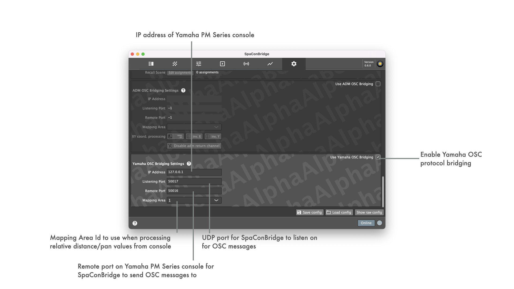

## Yamaha / L'ISA OSC bridging settings

**Yamaha OSC bridging support is experimental - the commands as described below are used in the L'ISA control UI integrated in Yamaha PM series consoles and have been tested only once to actually work ;)**

### Implemented OSC messages

| OSC input from PM series console | Internal remote object | |
| -- | -- | -- |
| _/ymh/src/[CH]/p_ | Mapped Sound Object Position X | _DS100 target mapping area id is filled in from config_ |
| _/ymh/src/[CH]/d_ | Mapped Sound Object Position Y | _DS100 target mapping area id is filled in from config_ |
| _/ymh/src/[CH]/s_ | Matrix Input ReverbSendGain | |
| _/ymh/src/[CH]/w_ | Sound Object Spread | |